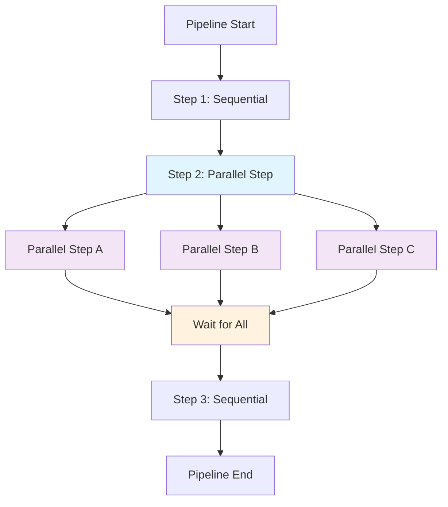

# Cheshire

[](https://github.com/ruivieira/cheshire/actions/workflows/ci.yml)
[](https://jsr.io/@rui/cheshire)
[](https://jsr.io/@rui/cheshire)

<div align="center">
  
</div>

A flexible, cross-platform pipeline execution system that supports Deno and Bun. Cheshire provides
both command-based and TypeScript-based steps with automatic platform detection and filtering.

**Note**: While Cheshire is designed to work with Deno and Bun, the main development and testing is
done on Deno. The library has been tested on Bun but Deno is the primary target runtime.

## Features

- **Cross-Platform Support**: Works with Deno and Bun
- **Flexible Execution**: Support for both command-based and TypeScript-based steps
- **Platform Compatibility**: Automatic platform detection and filtering
- **Parameter Substitution**: Dynamic parameter replacement in commands
- **Retry Logic**: Configurable retry mechanisms for failed steps
- **Dependency Injection**: Custom executable functions for command execution
- **Real-time Output**: Live command output with spinners and progress indicators

## Installation

### Deno

```bash
# Using JSR
deno add @rui/cheshire

# Or import directly
import { PipelineExecutor } from "jsr:@rui/cheshire@^0.2.0";
```

### Bun

```bash
# Install via npm
bun add @rui/cheshire

# Or install from GitHub
bun add rui/cheshire
```

## Usage

### Deno

```typescript
import { PipelineExecutor, type Run, SimpleStep } from "jsr:@rui/cheshire@^0.2.0";

const pipeline: Run = {
  id: "example",
  name: "Example Pipeline",
  platform: "linux",
  steps: [
    new SimpleStep("step1", "Echo Hello", "echo 'Hello, World!'"),
    new SimpleStep("step2", "List Files", "ls -la"),
  ],
};

const executor = new PipelineExecutor();
const result = await executor.executeRun(pipeline);
console.log(`Pipeline ${result.success ? "succeeded" : "failed"}`);
```

## Platform Detection

Cheshire automatically detects the current platform and provides platform-specific functionality:

```typescript
import { detectPlatform, setPlatformProvider } from "@rui/cheshire";

// Automatic platform detection
const platform = detectPlatform();
console.log(`Current platform: ${platform}`);

// Custom platform provider (for testing or custom environments)
setPlatformProvider({
  getOS: () => "linux",
  readTextFileSync: (path: string) => "ID=fedora",
  env: (key: string) => process.env[key],
});
```

## Cross-Platform Compatibility

The library automatically adapts to the runtime environment:

- **Deno**: Uses `Deno.Command` for process execution
- **Bun**: Uses `Bun.spawn` for process execution

All platform-specific APIs are abstracted behind a common interface, ensuring consistent behaviour
across runtimes.

## Basic Usage

### Simple Pipeline

```typescript
import { PipelineExecutor, type Run, SimpleStep } from "./mod.ts";

const pipeline: Run = {
  id: "example",
  name: "Example Pipeline",
  platform: "linux",
  steps: [
    new SimpleStep("step1", "Echo Hello", "echo 'Hello, World!'"),
    new SimpleStep("step2", "List Files", "ls -la"),
  ],
};

const executor = new PipelineExecutor();
const result = await executor.executeRun(pipeline);
console.log(`Pipeline ${result.success ? "succeeded" : "failed"}`);
```

### Using Custom Executable Function

You can inject your own command execution logic:

```typescript
import { type ExecutableFunction, PipelineExecutor, type Run, SimpleStep } from "./mod.ts";

// Custom executable function that uses your own run implementation
const customExecutable: ExecutableFunction = async (command: string, timeout?: number) => {
  // Use your own run function from @core.ts
  const { run } = await import("../ubik/src/libs/core.ts");

  const success = await run(command.split(" "));
  return {
    success,
    output: success ? "Command executed successfully" : "Command failed",
    error: success ? undefined : "Command failed with exit code",
  };
};

const pipeline: Run = {
  id: "example",
  name: "Example Pipeline",
  platform: "linux",
  steps: [
    new SimpleStep("step1", "Echo Hello", "echo 'Hello, World!'"),
  ],
};

// Pass the custom executable function to the executor
const executor = new PipelineExecutor(false, customExecutable);
const result = await executor.executeRun(pipeline);
```

### Template Steps with Parameters

```typescript
import { type Run, TemplateStep } from "./mod.ts";

const pipeline: Run = {
  id: "template-example",
  name: "Template Pipeline",
  platform: "linux",
  steps: [
    new TemplateStep(
      "greet",
      "Greet User",
      "echo 'Hello, ${name}! Welcome to ${project}.'",
      { name: "Alice", project: "Cheshire" },
    ),
  ],
};
```

### TypeScript Steps

```typescript
import { type Run, Step } from "./mod.ts";

class CustomTypeScriptStep extends Step {
  constructor() {
    super("custom", "Custom TypeScript Step", {
      description: "A custom TypeScript step",
    });
  }

  getCommand(): string {
    return "echo 'This is a fallback command'";
  }

  async execute(): Promise<{ success: boolean; output?: string; error?: string }> {
    // Custom TypeScript logic here
    const result = await someAsyncOperation();
    return {
      success: result.success,
      output: result.output,
      error: result.error,
    };
  }

  validateParameters(): string[] {
    return [];
  }
}

const pipeline: Run = {
  id: "typescript-example",
  name: "TypeScript Pipeline",
  platform: "linux",
  steps: [new CustomTypeScriptStep()],
};
```

### Parallel Steps

Execute multiple steps simultaneously to improve performance:

```typescript
import { ParallelStep, type Run, SimpleStep } from "./mod.ts";

// Individual steps
const step1 = new SimpleStep("step1", "Install Package A", "echo 'Installing A' && sleep 2");
const step2 = new SimpleStep("step2", "Install Package B", "echo 'Installing B' && sleep 3");
const step3 = new SimpleStep("step3", "Install Package C", "echo 'Installing C' && sleep 1");

// Parallel step that executes all three simultaneously
const parallelStep = new ParallelStep("parallel-install", "Install packages in parallel", [
  step1,
  step2,
  step3,
], {
  description: "Installs multiple packages simultaneously to save time",
});

const pipeline: Run = {
  id: "parallel-example",
  name: "Parallel Pipeline",
  platform: "linux",
  steps: [
    parallelStep,
    new SimpleStep("final", "Final setup", "echo 'All packages installed'"),
  ],
};
```

The parallel step will execute all contained steps simultaneously and only proceed to the next step
when all parallel steps complete. If any step fails, the parallel step fails.

### Parallel Execution Flow



**Key Benefits:**

- **Performance**: Steps execute simultaneously, reducing total execution time
- **Synchronisation**: Pipeline waits for all parallel steps to complete before continuing
- **Error Handling**: Any failure in parallel steps causes the entire parallel step to fail
- **Flexibility**: Can contain any combination of step types (SimpleStep, TemplateStep, etc.)

## API Reference

### Core Types

- `Run`: Main pipeline configuration
- `Step`: Base class for pipeline steps
- `PreCondition`: Base class for pre-conditions
- `Test`: Base class for tests
- `ExecutableFunction`: Type for custom command execution functions

### Executor

- `PipelineExecutor`: Main executor class
  - `constructor(verbose?: boolean, executableFunction?: ExecutableFunction)`
  - `executeRun(run: Run): Promise<RunResult>`

### Step Classes

- `SimpleStep`: Basic command step
- `TemplateStep`: Step with parameter substitution
- `PackageInstallStep`: Package installation step
- `DockerStep`: Docker container step
- `ShellStep`: Shell command step
- `ParallelStep`: Container step that executes multiple steps in parallel

## Examples

See the `examples/` directory for more detailed examples.

## Contributing

1. Fork the repository
2. Create a feature branch
3. Make your changes
4. Add tests
5. Submit a pull request

## Running CI Tests Locally

You can run the CI tests locally using [act](https://github.com/nektos/act):

```bash
# Install act (if not already installed)
# macOS: brew install act
# Linux: curl https://raw.githubusercontent.com/nektos/act/master/install.sh | sudo bash

# Run all CI jobs
./scripts/run-ci-local.sh

# Run specific jobs
./scripts/run-ci-local.sh deno
./scripts/run-ci-local.sh bun
```

For more details, see [Running CI Tests Locally](docs/RUNNING_CI_LOCALLY.md).

## License

Apache License 2.0 - see LICENSE file for details.
